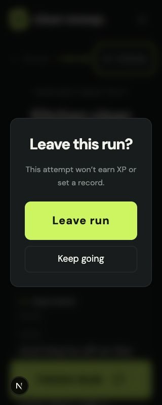

# Clean Sweep accessibility audit

Reviewed October 7, 2026. This is a targeted manual audit against WCAG 2.2 AA and WAI-ARIA interaction guidance, not a conformance certification.

## Remediation update

The reported defects and recommendations have been implemented:

- Native modal dialog makes background content inert, starts focus on Keep going, wraps Tab/Shift-Tab, supports Escape, associates its description, and restores the opener on dismissal.
- Screen transitions focus the new h1; returning from a run/results restores the original chore card. Each screen sets a descriptive document title.
- Arena count now uses `#929a94` against `#111515` (approximately 6.37:1, above the 4.5:1 requirement).
- Commentators use a native labeled radio group with checked/disabled states and unlock descriptions. Arrow-key selection was verified.
- Mute controls expose pressed state with stable names. Timer has a label and role with live updates off. Persistent polite regions announce readiness, meaningful pace changes, results, and only the newest caption; older visible captions keep stable keys.
- Small navigation targets have a 44px minimum and a skip-to-content link is available.

Browser recheck: heading focus on booth and home, radio arrow navigation, run h1 focus, mute pressed state, dialog initial focus, both directions of Tab wrapping, Escape return to Arenas, and leave-run return to the original chore all verified. Run/home reflow at 320px was checked. Ten existing tests, TypeScript, and production build pass. No test run was saved to the player's profile. Real screen-reader and axe verification remain outstanding; result-screen behavior is implemented but not exercised against the live database.

The findings below describe the original audit state for reference.

## Method and scope

Inspected the app's source, rendered accessibility tree, computed CSS contrast, visible control dimensions, and keyboard interactions in the Codex in-app browser. Tested home, commentary booth, active run, and leave-run dialog. Checked reflow at 320 CSS pixels and the existing 635-pixel preview. Reviewed results in source only to avoid saving a fake run into the player's real database. Abandoned the audit attempt; no record or XP was saved.

No axe scan, VoiceOver/NVDA session, 200% text-only resizing, forced-colors check, or full live results test was performed. Findings below distinguish confirmed defects from recommendations. Contrast measurements use CSS foreground/background colors, not sampled screenshot pixels. The simple measurement routine does not account for gradients or opacity; such cases are not assigned pass/fail findings here.

## Findings

### High: leave-run modal does not manage keyboard focus

Location: `app/page.tsx`, `.modal-backdrop` / `.modal`.

Reproduction: start a chore, choose Arenas, then press Tab. Focus remains on Arenas when the dialog appears, then moves to the background Unmute button. Escape leaves the dialog open. `aria-modal="true"` declares a modal, but background controls remain keyboard reachable.

Impact: keyboard and screen-reader users can interact with the obscured run rather than the dialog. The timer and commentary continue while users look for the dialog controls.

Fix: use a native `<dialog>` with `showModal()` or an accessible dialog implementation. Move initial focus to Keep going, contain focus, make the background inert, support Escape, and restore focus to the invoking control when dismissed. Retain the existing accessible title and add a description association.

Related: WCAG 2.4.3 Focus Order; WAI-ARIA modal dialog keyboard guidance. Missing Escape alone is an interaction-guidance issue, not independently asserted as a WCAG failure.

### Medium: screen transitions discard focus and do not announce the new screen

Location: `app/page.tsx`, screen state changes and conditional screen rendering.

Reproduction: open the booth, Tab to the in-content Back to arenas button, activate it with Enter. The button disappears and `document.activeElement` becomes BODY. The same conditional rendering pattern is used for start, finish, and run-it-back. The document title also remains unchanged across all screens.

Impact: users lose their place and may need to discover the current screen again. Start readiness and completion are not reliably announced by screen navigation.

Fix: give each screen a main heading with `tabIndex={-1}` and focus it after navigation. Restore focus to the initiating chore card when returning to arenas where appropriate. Set a descriptive document title for each screen. Avoid moving focus for routine timer/caption updates.

Related: WCAG 2.4.3; exact announcements still need testing with a real screen reader.

### Medium: arena count fails normal-text contrast

Location: `app/globals.css`, `.section-heading h2 span`; visible `/ 05` beside Today's arenas.

Measured foreground `#677067` against `#111515`: **3.58:1**. The rendered text is 17px regular weight, requiring **4.5:1** for WCAG 1.4.3 AA.

Fix: use `var(--muted)` or a brighter color. Do not use the heading's larger font size to assess its smaller child span.

### Low / recommended: expose selection states directly

Location: `app/page.tsx`, `.persona-card`, mute controls.

Persona selection is communicated by the accessible text Your commentator and the visual selected border, so this is not recorded as a proven WCAG violation. However, no `aria-pressed`, checked state, or radio-group semantics is present.

Fix: represent the mutually exclusive personas as a labeled radio group, including a clear unlock explanation for unavailable choices. If mute uses `aria-pressed`, keep a stable accessible name such as Mute commentary and let the pressed state indicate mute status; alternatively keep the existing action-changing names.

### Low / recommended: improve run semantics and announcements

Location: `app/page.tsx`, run title, timer, pace and captions.

The active run has an h2 but no h1. The timer is a plain div without an accessible label. Countdown/start readiness and pace changes are not dedicated live statuses. Captions already have `aria-live="polite"`, but indexing the last two captions can replace the previous caption node as new lines arrive; check for repeated readings in a screen reader. The result caption's live-region container mounts together with its content, which may not announce consistently.

Fix: use an h1 for the chore title; label the timer with `role="timer"` and `aria-live="off"` to avoid announcing every second. Add a stable polite status region for run readiness, meaningful pace changes, and completion. Keep caption announcements to the newest line, separate from the visible feed. Test with VoiceOver/NVDA, especially alongside spoken commentary.

### Low / recommended: increase small navigation targets to 44px

The mobile header shortcut measures 38×38px and the Arenas control 76×40px. These meet WCAG 2.5.8's 24px size threshold, but fall short of a more comfortable 44px target. Finish is 280×76px; run mute is 106×48px; dialog controls are 222×76px and 222×52px.

Fix: give small navigation buttons a 44px minimum height/width without reducing visible text.

## Positive checks

- Native button semantics and accessible names are present for the tested controls.
- Keyboard Tab and Enter work for ordinary navigation.
- `:focus-visible` defines a 3px lime outline with a 5px offset; retain this during dialog repairs.
- The document declares English and permits user zoom in the viewport metadata.
- Main, header, and footer landmarks exist.
- All authored font sizes now have a 14px minimum, with larger body text and live captions. This is a readability improvement, not a standalone WCAG pass condition.
- Home and run reflow at 320px without horizontal document overflow; home headline wraps rather than truncates.
- Pace has text (AHEAD/BEHIND), so meaning is not dependent on color alone.
- Commentary captions remain available while muted.
- CSS honors reduced-motion preferences for transitions.
- Disabled persona cards include the unlock level in their text.

## Recommended fix order

1. Repair modal focus containment and restoration.
2. Add screen-transition focus and announcements.
3. Correct arena-count contrast.
4. Improve timer/status/selection semantics and touch targets.
5. Recheck using axe and actual screen readers, including results, errors, text resizing, text spacing, and forced colors.

## References

- [WCAG 1.4.3 Contrast (Minimum)](https://www.w3.org/WAI/WCAG22/Understanding/contrast-minimum.html)
- [WCAG 2.4.3 Focus Order](https://www.w3.org/WAI/WCAG22/Understanding/focus-order.html)
- [WAI-ARIA modal dialog pattern](https://www.w3.org/WAI/ARIA/apg/patterns/dialog-modal/)
- [WCAG 2.5.8 Target Size (Minimum)](https://www.w3.org/WAI/WCAG22/Understanding/target-size-minimum.html)

